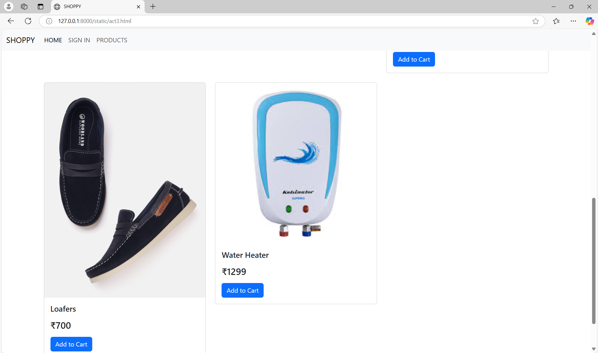

# Project Responsive Web Design using Bootstrap
## Date:25-12-2024

## AIM:
To create a simplified clone of Dribbble (https://dribbble.com/) landing page.


## DESIGN STEPS:

### Step 1:
Clone the repository from GitHub.

### Step 2:
Create Django Admin project.

### Step 3:
Create a New App under the Django Admin project.

### Step 4:
Insert the necessary CSS and JavaScript files as external in order to use Bootstrap.

### Step 5:
Create a HTML file and include the needed Bootstrap components.

### Step 6:
Publish the website in the LocalHost.

## PROGRAM :
```
act1.html

<!DOCTYPE html>
<html lang="en">
<head>
  <meta charset="UTF-8">
  <meta name="viewport" content="width=device-width, initial-scale=1.0">
  <title>SHOPPING WEBSITE </title>
  <!-- Bootstrap CSS -->
  <link href="https://cdn.jsdelivr.net/npm/bootstrap@5.3.0/dist/css/bootstrap.min.css" rel="stylesheet">
</head>
<body>
  
  <!-- Navbar -->
  <nav class="navbar navbar-expand-lg navbar-light bg-light">
    <div class="container-fluid">
      <a class="navbar-brand" href="#">SHOPPY</a>
      <button class="navbar-toggler" type="button" data-bs-toggle="collapse" data-bs-target="#navbarNav">
        <span class="navbar-toggler-icon"></span>
      </button>
      <div class="collapse navbar-collapse" id="navbarNav">
        <ul class="navbar-nav">
          <li class="nav-item">
            <a class="nav-link active" href="act1.html">HOME</a>
          </li>
          <li class="nav-item">
            <a class="nav-link" href="act2.html">SIGN IN </a>
          </li>
          <li class="nav-item">
            <a class="nav-link" href="act3.html">PRODUCTS </a>
          </li>
        </ul>
      </div>
    </div>
  </nav>

  <!-- Hero Section -->
  <div class="container-fluid bg-info  text-dark  text-center p-5">
    <h1>SHOPPY</h1>
    <p></p>
  </div>

  <!-- About Section -->
  <div class="container my-5" id="about">
    <h2></h2>
    <p></p>
  </div>

 
 
  <!-- Bootstrap JS -->
  <script src="https://cdn.jsdelivr.net/npm/bootstrap@5.3.0/dist/js/bootstrap.bundle.min.js"></script>
  <font align="center"><p><h1>Welcome to Shoppy</h1></font><br><br>
    Your One-Stop Online Shopping Destination!

    At Shoppy, we bring you a seamless shopping experience with a wide range of high-quality products designed to meet all your needs. From the latest electronics to stylish fashion, essential home goods, and unique gifts, we’ve got it all under one roof.
    
    Discover exciting deals, exclusive offers, and a user-friendly platform tailored to save you time and money. Whether you’re upgrading your home, exploring the newest trends, or finding the perfect present, Shoppy has everything you need.
    
    Start shopping today and experience the convenience of quality, variety, and affordability – all at Shoppy!</h1></p>
     <!-- Footer -->
  <footer class="text-center py-3 bg-light">
    <p>Designed and Developed by Sri Srinivasan K </p>
  </footer>

</body>
</html>

act2.html

<!-- Hero Section -->
<link href="https://cdn.jsdelivr.net/npm/bootstrap@5.3.0/dist/css/bootstrap.min.css" rel="stylesheet">
<script src="https://cdn.jsdelivr.net/npm/bootstrap@5.3.0/dist/js/bootstrap.bundle.min.js"></script>
<body>
  
  <!-- Navbar -->
  <nav class="navbar navbar-expand-lg navbar-light bg-light">
    <div class="container-fluid">
      <a class="navbar-brand" href="#">SHOPPY</a>
      <button class="navbar-toggler" type="button" data-bs-toggle="collapse" data-bs-target="#navbarNav">
        <span class="navbar-toggler-icon"></span>
      </button>
      <div class="collapse navbar-collapse" id="navbarNav">
        <ul class="navbar-nav">
          <li class="nav-item">
            <a class="nav-link active" href="act1.html">HOME</a>
          </li>
          <li class="nav-item">
            <a class="nav-link" href="act2.html">SIGN IN </a>
          </li>
          <li class="nav-item">
            <a class="nav-link" href="act3.html">PRODUCTS </a>
          </li>
        </ul>
      </div>
    </div>
  </nav>
</body>
<div class="container-fluid bg-info text-dark text-center p-5">
   <h1>SHOPPY</h1>
   <p>Your one-stop shopping destination!</p>
 </div>
 <div class="container my-5" id="contact">
   <h2>Contact Us</h2>
   <form onsubmit="return handleFormSubmit(event)">
     <div class="mb-3">
       <label for="name" class="form-label">Name</label>
       <input type="text" class="form-control" id="name" placeholder="Your Name" required>
     </div>
     <div class="mb-3">
        <label for="number" class="form-label">Mobile Number</label>
        <input type="tel" class="form-control" id="number" placeholder="Your Mobile Number" pattern="[0-9]{10}" required>
      </div>
     <div class="mb-3">
       <label for="email" class="form-label">Email</label>
       <input type="email" class="form-control" id="email" placeholder="Your Email" required>
     </div>
     <div class="mb-3">
        <label for="address" class="form-label">Address</label>
        <textarea class="form-control" id="address" placeholder="Your Address" rows="3" required></textarea>
      </div>
      
     <button type="submit" class="btn btn-primary">Submit</button>
     <button type="reset" class="btn btn-secondary">Clear All</button>
   </form>
 </div>

<script>
  function handleFormSubmit(event) {
    event.preventDefault();
    const name = document.getElementById('name').value;
    const number = document.getElementById('number').value;
    const email = document.getElementById('email').value;
    const address = document.getElementById('address').value;

    if (name && number && email && address) {
      alert(`Thank you, ${name}! Your details have been submitted successfully.`);
    } else {
      alert('Please fill out all fields correctly.');
    }
  }
</script>

act3.html

<!DOCTYPE html>
<html lang="en">
<head>
    <meta charset="UTF-8">
    <meta name="viewport" content="width=device-width, initial-scale=1.0">
    <title>SHOPPY</title>
    <link href="https://cdn.jsdelivr.net/npm/bootstrap@5.3.0/dist/css/bootstrap.min.css" rel="stylesheet">
    <script src="https://cdn.jsdelivr.net/npm/bootstrap@5.3.0/dist/js/bootstrap.bundle.min.js"></script>
    <style>
        .card:hover {
            transform: scale(1.05);
            transition: transform 0.3s ease;
        }

        .navbar {
            position: sticky;
            top: 0;
            z-index: 1020;
            background-color: #f8f9fa;
        }

        body {
            scroll-behavior: smooth;
        }
    </style>
</head>
<body>
    <!-- Navbar -->
    <nav class="navbar navbar-expand-lg navbar-light bg-light">
        <div class="container-fluid">
            <a class="navbar-brand" href="#">SHOPPY</a>
            <button class="navbar-toggler" type="button" data-bs-toggle="collapse" data-bs-target="#navbarNav">
                <span class="navbar-toggler-icon"></span>
            </button>
            <div class="collapse navbar-collapse" id="navbarNav">
                <ul class="navbar-nav">
                    <li class="nav-item">
                        <a class="nav-link active" href="act1.html">HOME</a>
                    </li>
                    <li class="nav-item">
                        <a class="nav-link" href="act2.html">SIGN IN</a>
                    </li>
                    <li class="nav-item">
                        <a class="nav-link" href="act3.html">PRODUCTS</a>
                    </li>
                </ul>
            </div>
        </div>
    </nav>

    <!-- Hero Section -->
    <div class="container-fluid bg-info text-dark text-center p-5">
        <h1>SHOPPY</h1>
        <p>Find the best products at unbeatable prices!</p>
        <a href="#products" class="btn btn-dark">Explore Products</a>
    </div>

    <!-- Products Section -->
    <div class="container my-5" id="products">
        <h2 class="text-center mb-4">Our Products</h2>
        <div class="row g-4">
            <div class="col-md-4">
                <div class="card">
                    
                    <div class="card-body">
                        <h5 class="card-title">Cotton Blend T-shirt</h5>
                        <p class="card-text">
                            <h4>30% Off - ₹499</h4>
                        </p>
                        <button class="btn btn-primary" onclick="alert('Added to cart: Cotton Blend T-shirt')">Add to Cart</button>
                    </div>
                </div>
            </div>

            <div class="col-md-4">
                <div class="card">
                    
                    <div class="card-body">
                        <h5 class="card-title">Checked Shirt</h5>
                        <p class="card-text">
                            <h4>10% Off - ₹700</h4>
                            <span class="text-danger">Only 5 left!</span>
                        </p>
                        <button class="btn btn-primary" onclick="alert('Added to cart: Checked Shirt')">Add to Cart</button>
                    </div>
                </div>
            </div>

            <div class="col-md-4">
                <div class="card">
                    
                    <div class="card-body">
                        <h5 class="card-title">Black Jeans</h5>
                        <p class="card-text">
                            <h4>₹1299</h4>
                        </p>
                        <button class="btn btn-primary" onclick="alert('Added to cart: Black Jeans')">Add to Cart</button>
                    </div>
                </div>
            </div>

            <div class="col-md-4">
                <div class="card">
                    
                    <div class="card-body">
                        <h5 class="card-title">Loafers</h5>
                        <p class="card-text">
                            <h4>₹700</h4>
                        </p>
                        <button class="btn btn-primary" onclick="alert('Added to cart: Loafers')">Add to Cart</button>
                    </div>
                </div>
            </div>

            <div class="col-md-4">
                <div class="card">
                    
                    <div class="card-body">
                        <h5 class="card-title">Water Heater</h5>
                        <p class="card-text">
                            <h4>₹1299</h4>
                        </p>
                        <button class="btn btn-primary" onclick="alert('Added to cart: Water Heater')">Add to Cart</button>
                    </div>
                </div>
            </div>
        </div>
    </div>

    <!-- Footer -->
    <footer class="text-center bg-light py-3">
        <p>&copy; 2024 SHOPPY. All rights reserved.</p>
    </footer>
</body>
</html>


```

## OUTPUT:




## RESULT:
The Project for responsive web design using Bootstrap is completed successfully.
